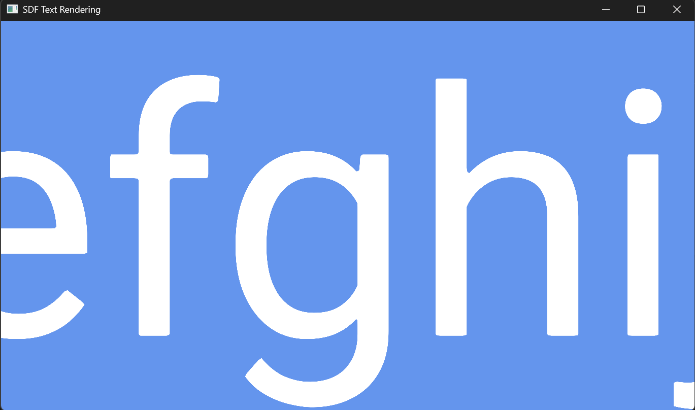
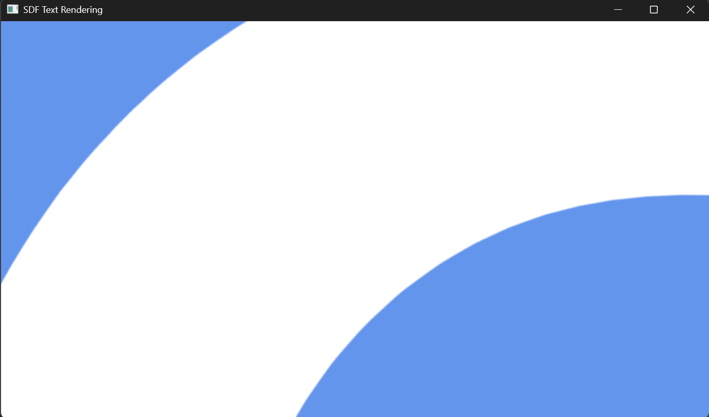

# SDF Text Rendering

A small C++ / OpenGL experiment exploring Signed Distance Field (SDF) text rendering.

The project explores rendering text from a distance-field texture, allowing glyphs to remain sharp at different sizes and scales.

## Build
Run:
```bash
build.bat
```

## Screenshots



